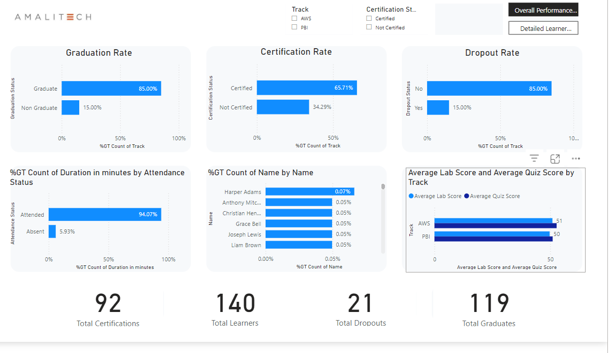
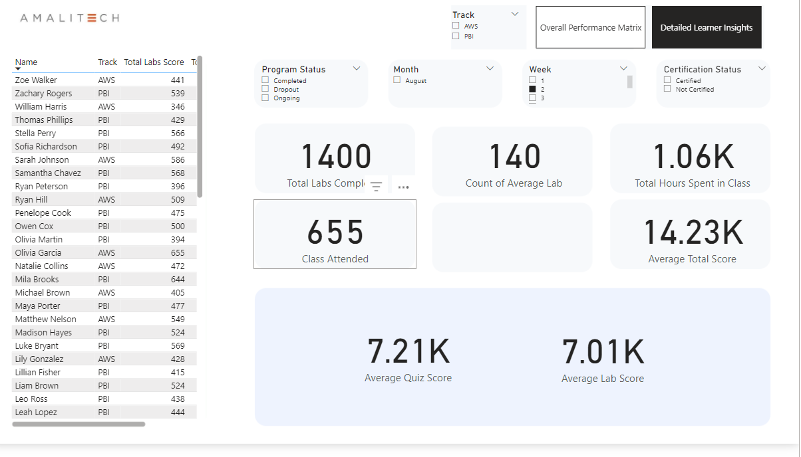

# Global Careers Project

## Description

The Global Careers Project is designed to track students' progress and performance in various training programs. It includes data on participation, attendance, and quizzes, providing insights into student engagement and success.

## Usage

- The project includes various data files that can be analyzed using tools like Power BI or Excel.
- Open the relevant `.pbix` files in Power BI to visualize the data.

## Data Structure

- **Data/**: Contains all data files related to training, participation, and attendance.
  - **Cloud Training/**: Data specific to cloud training programs.
  - **PowerBI Training/**: Data specific to Power BI training programs.
  - **Merged Data/**: Consolidated data from various sources.
- **Images/**: Contains images used in the project, such as dashboards and overviews.
- **UI/**: Contains snapshot images of the project's user interface.

## Sample UI

Page 1

Page 2

